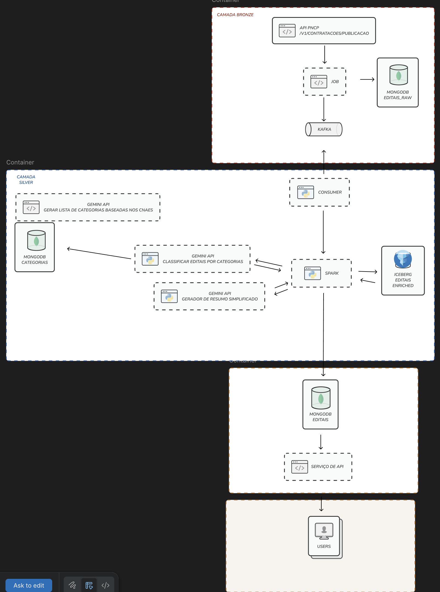
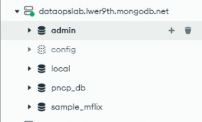
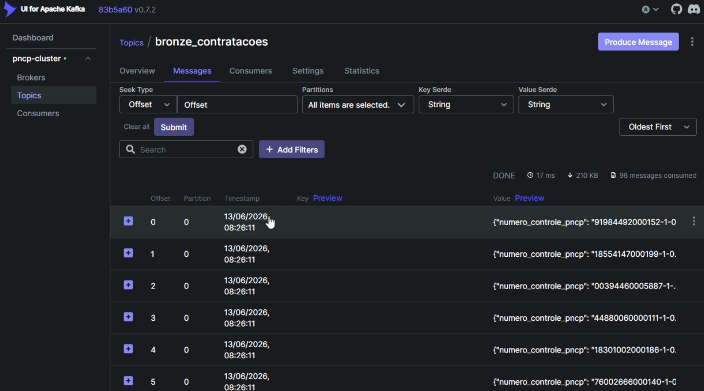
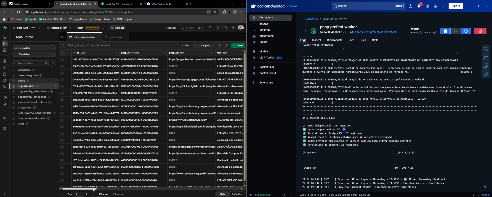
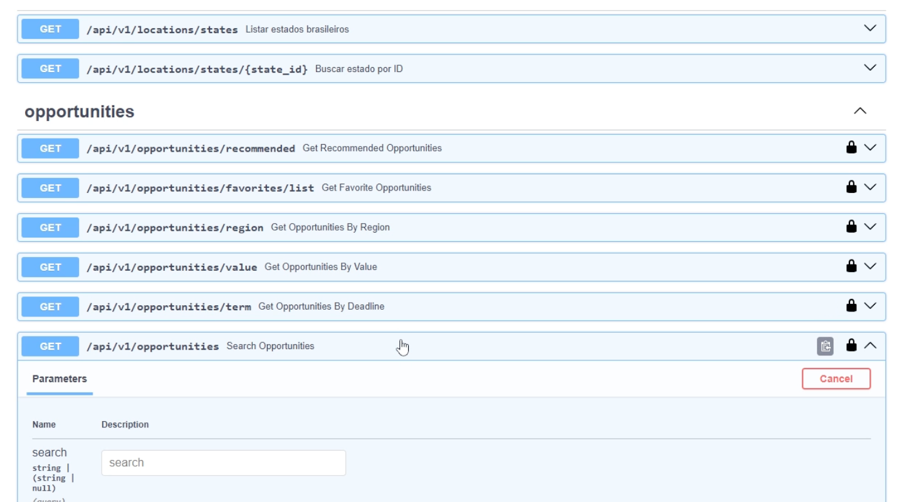
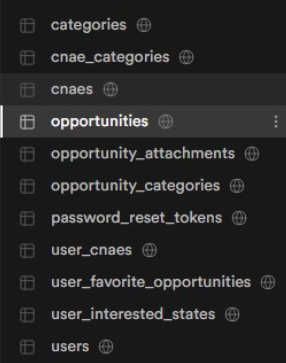
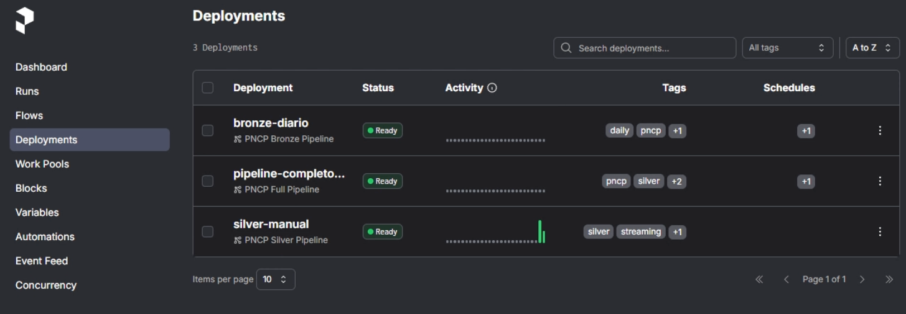
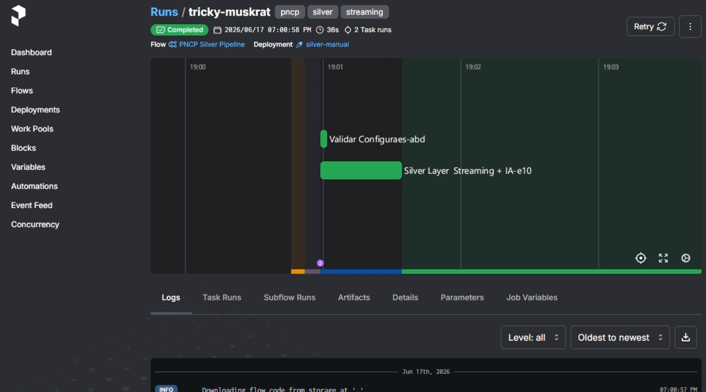

# LicitaFácil BFF — Plataforma DataOps

> Backend-for-Frontend e pipeline de dados que captura, enriquece com IA e recomenda
> oportunidades de licitação pública para Microempreendedores Individuais (MEI),
> organizado como um monorepo de aplicações Python.

---

## 📌 Motivação

O **PNCP (Portal Nacional de Contratações Públicas)** publica diariamente milhares de
editais. Para um MEI, garimpar manualmente esse volume em busca de oportunidades
compatíveis com a sua atividade (CNAE) é inviável: o dado é volumoso, pouco
estruturado e cheio de campos aninhados.

O **LicitaFácil** resolve isso transformando o fluxo bruto do PNCP em recomendações
personalizadas:

- **Captura** os editais publicados no PNCP de forma idempotente e contínua.
- **Enriquece** cada edital com IA (Gemini), classificando-o por CNAE, gerando um
  resumo simplificado e um score de confiança.
- **Entrega** ao app do usuário apenas as oportunidades relevantes para os seus CNAEs
  e estados de interesse, ordenadas por confiança, valor ou prazo.

O resultado é uma plataforma que aproxima o pequeno empreendedor das compras públicas,
reduzindo a barreira de entrada nas licitações.

---

## 🏛️ Arquitetura

O projeto segue a **arquitetura Medallion (Bronze / Silver / Gold)**, com componentes
transversais de orquestração e manutenção.



### Camadas em detalhe

| Camada | App | Responsabilidade | Tecnologias |
|--------|-----|------------------|-------------|
| **Bronze** | `apps/ingestion` | Captura crua do PNCP, normalização leve, persistência e publicação de eventos | PNCP API, MongoDB, Kafka |
| **Silver** | `apps/processor` | Enriquecimento com IA, deduplicação, materialização versionada | Spark Structured Streaming, Gemini 2.5 Flash, Apache Iceberg, Supabase |
| **Gold** | `apps/api` | Servir recomendações ao app (BFF) | FastAPI, JWT, PostgreSQL/Supabase (RLS) |
| **Transversal** | `apps/maintenance` + `orchestrate_prefect.py` | Orquestração, agendamento, manutenção do data lake e analytics | Prefect, Spark, Iceberg |

**Por que cada escolha:**

- **MongoDB na Bronze** — o dado do PNCP é semiestruturado e muda de forma; um document
  store evita brigar com schema rígido. O *upsert* por `numero_controle_pncp` garante
  **idempotência** (reprocessar não duplica).
- **Kafka entre Bronze e Silver** — desacopla ingestão de processamento. A Silver pode
  cair, reprocessar offsets e se recuperar sem perder eventos ("at least once").
- **Spark Structured Streaming** — processa micro-batches do Kafka com checkpoint
  (tolerância a falha) e escala o enriquecimento.
- **Gemini com lista fechada de CNAEs** — o prompt restringe a IA a um catálogo válido e
  a resposta é validada contra os CNAEs oficiais; códigos inventados são descartados.
  Há *retry* (até 3 tentativas) para resiliência a falhas transitórias da API.
- **Apache Iceberg + Supabase** — armazenamento duplo: Iceberg guarda o histórico
  versionado (snapshots, time travel) e o Supabase/PostgreSQL serve leituras rápidas
  ao app.
- **Prefect** — orquestra os flows com agendamento (cron), retries e timeouts.

---

## 🧰 Stack tecnológica

| Função | Tecnologia |
|--------|-----------|
| Fonte de dados | PNCP API |
| Armazenamento bruto (Bronze) | MongoDB 7.0 |
| Mensageria / streaming | Apache Kafka (Confluent 7.5.0) + Zookeeper |
| Processamento distribuído | Apache Spark / PySpark |
| Enriquecimento com IA | Google Gemini 2.5 Flash |
| Data Lake versionado (Silver) | Apache Iceberg |
| Banco da aplicação (Gold) | PostgreSQL via Supabase |
| API / BFF | FastAPI + Uvicorn |
| Orquestração | Prefect |
| Containerização | Docker / Docker Compose |
| Runtime | Python 3.11 + Java 17 (Spark) |

---

## 📁 Estrutura do monorepo

```
licitafacil-bff/
├── apps/
│   ├── ingestion/        # Bronze — captura PNCP → MongoDB + Kafka
│   │   └── src/{main.py, core/config.py, services/, repositories/}
│   ├── processor/        # Silver — Spark streaming + Gemini → Iceberg + Supabase
│   │   └── src/{main.py, core/config.py, services/, repositories/}
│   ├── api/              # Gold — FastAPI (recomendações, auth)
│   │   └── src/{main.py, core/, api/v1/routes/, db/, repositories/, services/}
│   └── maintenance/      # Transversal — manutenção Iceberg + analytics agendados
│       └── src/{main.py, core/config.py, services/, cronjob/}
├── libs/
│   ├── clients/          # PNCPClient (cliente da API PNCP)
│   └── common/           # Settings base, KafkaProducer
├── docs/                 # Documentação (ver docs/LicitaFacil-DataOps.md)
├── orchestrate_prefect.py# Flows e deployments do Prefect
├── run_bronze.py         # Execução manual da Bronze (por intervalo de datas)
├── docker-compose.yml    # Stack completa (Kafka, Mongo, Prefect, API…)
├── Dockerfile            # Imagem do worker Prefect (Python + Java + Spark)
├── pyproject.toml        # Metadados e ferramentas (ruff, mypy, pytest)
└── .env.example          # Template de variáveis de ambiente
```

---

## ✅ Requisitos

- **Docker** e **Docker Compose** (forma recomendada de executar)
- Para execução local fora de containers:
  - **Python 3.11+**
  - **Java 17** (necessário para o PySpark)
- Credenciais/segredos externos:
  - **GEMINI_API_KEY** — chave da API do Google Gemini
  - **SUPABASE_URL** e **SUPABASE_KEY** — projeto Supabase (camadas Silver/Gold)
  - Acesso ao **MongoDB** (provisionado pelo Compose ou externo, ex.: Atlas)

---

## ⚙️ Configuração

Copie o template e preencha as variáveis:

```bash
cp .env.example .env
```

Variáveis principais (`libs/common/config.py` define os defaults e a validação):

| Variável | Descrição | Default |
|----------|-----------|---------|
| `PNCP_BASE_URL` | Base da API PNCP | `https://pncp.gov.br/api/consulta` |
| `MONGO_URI` | Conexão MongoDB | *(obrigatória)* |
| `MONGO_DATABASE` | Database da Bronze | `pncp_db` |
| `MONGO_COLLECTION` | Coleção da Bronze | `contratacoes` |
| `KAFKA_BOOTSTRAP_SERVERS` | Brokers Kafka | `localhost:9092` |
| `KAFKA_BRONZE_TOPIC` | Tópico da Bronze | `bronze_contratacoes` |
| `GEMINI_API_KEY` | Chave do Gemini (Silver) | *(obrigatória p/ Silver)* |
| `SUPABASE_URL` / `SUPABASE_KEY` | Projeto Supabase | *(obrigatórias)* |
| `ICEBERG_WAREHOUSE_PATH` | Diretório do warehouse Iceberg | `/tmp/iceberg-warehouse` |
| `ICEBERG_DATABASE` / `ICEBERG_TABLE` | Namespace/tabela Silver | `pncp_silver` / `editais_enriched` |
| `SPARK_CHECKPOINT_DIR` | Checkpoint do Spark Streaming | `/tmp/processor-checkpoint-silver` |
| `LOG_LEVEL` | Nível de log (ver Observabilidade) | `INFO` |

Cada app estende essa configuração base com ajustes próprios:
`ConsumerSettings` (ingestion), `SparkSettings` (processor) e `CronjobSettings`
(maintenance), todos com um método `validate()` que falha cedo se faltar variável
obrigatória.

> ⚠️ **Segredos nunca vão para o Git.** O `.env` é local; use o `.env.example` como
> referência. Não commite chaves do Gemini, Supabase ou senhas de banco.

---

## 🚀 Como rodar

### Opção 1 — Stack completa com Docker Compose (recomendado)

Sobe Kafka, Zookeeper, MongoDB, Kafka UI, a API e o servidor + worker do Prefect:

```bash
docker-compose up -d --build
```

Serviços expostos:

| Serviço | URL | Descrição |
|---------|-----|-----------|
| Prefect UI | http://localhost:4200 | Orquestração e acompanhamento dos flows |
| Kafka UI | http://localhost:8080 | Inspeção de tópicos e mensagens |
| API (Gold) | http://localhost:8000 | BFF — `/health` e `/api/v1/...` (Swagger em `/docs`) |
| MongoDB | localhost:27017 | Armazenamento Bronze |

O worker do Prefect (`pncp-prefect-worker`) registra os deployments ao iniciar
(`orchestrate_prefect.py serve`).

### Opção 2 — Executar pipelines manualmente

Com a infra de pé, dispare os flows pelo Prefect ou rode os apps diretamente:

```bash
# Bronze para um intervalo de datas (AAAAMMDD)
docker exec pncp-prefect-worker python run_bronze.py 20260101 20260105

# Via orquestrador Prefect (one-shot)
python orchestrate_prefect.py bronze      # só Bronze
python orchestrate_prefect.py silver      # só Silver
python orchestrate_prefect.py             # pipeline completo (Bronze + Silver)

# Apps individualmente (requer infra + variáveis no ambiente)
python apps/ingestion/src/main.py         # Bronze
python apps/processor/src/main.py         # Silver (Spark Streaming)
python apps/maintenance/src/main.py       # Scheduler de manutenção
```

### Deployments e agendamento (Prefect)

| Deployment | Flow | Agendamento |
|-----------|------|-------------|
| `bronze-diario` | `bronze_pipeline` | Cron `0 7 * * *` (07h diariamente) |
| `pipeline-completo-diario` | `full_pipeline` | Cron `0 7 * * *` |
| `silver-manual` | `silver_pipeline` | Sob demanda |

O flow Bronze faz *retry* (2 tentativas, 60s de intervalo); o Silver tem timeout de
3600s por execução.

---

## 🔍 A jornada de um edital (fim a fim)

1. **Ingestão (Bronze):** o `PNCPClient` pagina a API; cada registro é normalizado e
   sofre *upsert* no MongoDB por `numero_controle_pncp` (idempotência) e é publicado no
   tópico Kafka `bronze_contratacoes`.
2. **Enriquecimento (Silver):** o Spark consome o Kafka em micro-batches, deduplica,
   envia cada edital ao Gemini (classificação por CNAE + resumo + confiança), valida a
   resposta contra o catálogo oficial e grava em **Iceberg** (histórico versionado) e
   **Supabase** (leitura rápida).
3. **Consumo (Gold):** a API cruza os CNAEs e estados do usuário com as oportunidades
   enriquecidas e devolve recomendações ordenadas por confiança, valor ou prazo.
4. **Manutenção (Transversal):** jobs agendados compactam arquivos pequenos e expiram
   snapshots antigos do Iceberg, além de materializar métricas de analytics.

---

## 🖼️ Capturas do pipeline em execução

**Bronze — dados crus no MongoDB e eventos no Kafka**




**Silver — processamento orquestrado e gravação no Supabase**



**Gold — API e dados servidos ao app**




**Orquestração — deployments e execução no Prefect**




---

## 📊 Observabilidade e logging

> Este é um dos pontos que padronizamos no projeto.

Todo o pipeline usa o módulo **`logging`** da biblioteca padrão — **não há `print()`**
no código de produção. A convenção:

- Cada módulo cria seu logger: `logger = logging.getLogger(__name__)`.
- Os *entrypoints* (`main.py` de cada app) configuram o formato e o nível uma única vez:

  ```python
  logging.basicConfig(
      level=os.getenv("LOG_LEVEL", "INFO"),
      format="%(asctime)s | %(levelname)s | %(name)s | %(message)s",
  )
  ```

- **Níveis semânticos:**
  - `logger.info(...)` — progresso normal (registros extraídos, batch processado, etc.)
  - `logger.warning(...)` — situações recuperáveis (registro que falhou na transformação)
  - `logger.error(...)` — falhas (erro ao publicar no Kafka, ao gravar no Iceberg, ao
    chamar o Gemini)
- **Formatação preguiçosa (lazy):** sempre `logger.info("Extraídos %s registros", n)` em
  vez de f-strings, para que a interpolação só ocorra se o nível estiver habilitado.

Ajuste a verbosidade por ambiente com a variável `LOG_LEVEL` (ex.: `DEBUG`, `INFO`,
`WARNING`).

---

## 🧪 Qualidade

```bash
# Lint e checagem de tipos
ruff check .
mypy apps libs

# Formatação
ruff format .

# Testes
pytest apps/*/tests libs/*/tests
```

O `pyproject.toml` da raiz centraliza a configuração das ferramentas (ruff com
`line-length=88` e regras `E,W,F,I,UP,B`; mypy com `disallow_untyped_defs`; pytest
apontando para os testes de cada app/lib).

---

## 📚 Documentação adicional

- **[`docs/LicitaFacil-DataOps.md`](docs/LicitaFacil-DataOps.md)** — documento completo
  da arquitetura DataOps, camada por camada, com a jornada de um edital e a stack
  tecnológica.
- **`docs/assets/`** — diagramas de arquitetura e capturas de tela (MongoDB, Kafka,
  Prefect, Supabase, Swagger).
- **`docs/passo_a_passo_screencast.md`** — guia passo a passo para demonstração.
